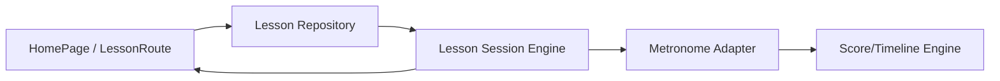
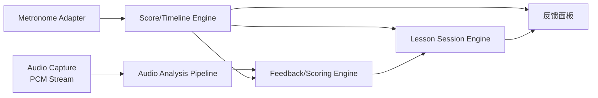
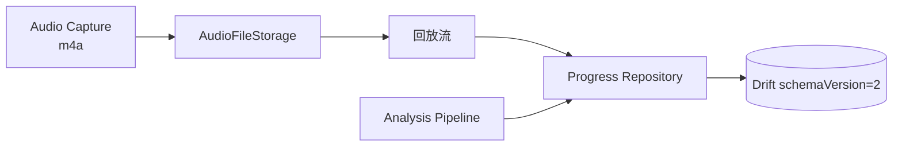
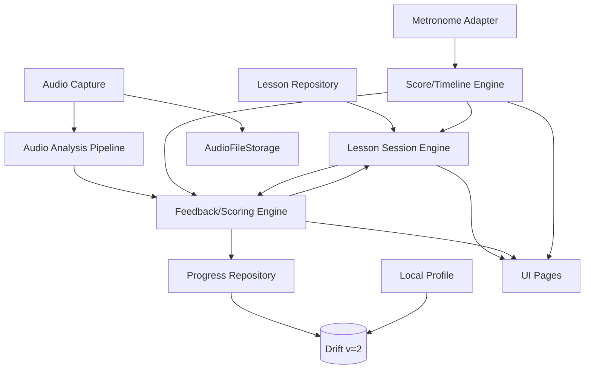

# SDD V2 — Product V2 系统设计（ukulele_app）

> Task ID：`T047_PRODUCT_V2_SYSTEM_DESIGN` / `T047A_CORRECT_PRODUCT_V2_SYSTEM_DESIGN` / `T047B_FIX_MULTI_VERSION_DRIFT_MIGRATION_DESIGN`
> 上游：`docs/PRD_v2.md` v0.3（已批准）
> 起始 HEAD：`30b786b`（T047） / `14f63ad`（T047A / T047B）
> 测试基线：744
> 最后更新：2026-06-25 | 版本：0.4
> 状态：**设计**（仅文档；不实现任何代码；不修改生产代码 / 测试 / `pubspec.yaml` / Manifest / Drift schema）
> 是否引入依赖 / 修改 Android 配置：**否**
> 多 Agent 协作：Primary Agent（主会话）/ Audio Architecture Reviewer `t047a-audio-reviewer`（**Approved**） / Flutter Data Architecture Reviewer `t047a-flutter-data-reviewer`（**Approved**）/ T047B Flutter Data Architecture Reviewer `t047b-flutter-data-reviewer`（**Approved**）；Product Alignment 不重复运行（本次未改 PRD 范围）；上一轮 v0.2 Reviewer `a29d26f55a6a993e8` / `af3e5bbcdbc28a57d` / `aaa74dd285a4ed015`（v0.2 Approved with Conditions，0 Blocker；v0.3 修正三项架构问题后重审）

---

## 1. 设计目标与边界

### 1.1 目标

为 Product V2 长期功能对标（P1-P6）设计**稳定架构骨架**，并为第一互动切片（P2）提供 TDD 边界。本 SDD 回答"系统由哪些模块组成、如何协作、数据如何流动"，不锁定识别算法，不预设具体音频输入路径。

### 1.2 平台边界声明

| 平台 / 调弦 | SDD 状态 | 说明 |
|-------------|----------|------|
| **Android** | 优先目标 | P1-P6 全部阶段；minSdk=23 / targetSdk=36 / compileSdk=36（v1.1.0 既有） |
| **common High-G GCEA 尤克里里** | 优先目标 | 默认 21 寸 Soprano，**不限定** 21 寸（PRD §1 / §2） |
| **iOS** | **Deferred + 前置条件**（**非永久 Out**） | P6+；受 PRD §10 合规前置约束（跨平台工程选型 + UX 重做 + 合规前置 + 测试设备） |
| **平板 UI** | **Deferred + 前置条件**（**非永久 Out**） | P6+；设计 token 扩展 + 布局组件 + 跨设备测试 |
| **Low-G 调弦** | **Deferred + 前置条件**（**非永久 Out**） | Audio Intelligence 阶段或之后；Low-G 音高映射表 + 调音器算法适配 + 内容制作 |
| **多乐器（吉他 / 钢琴 / 鼓 / 古筝等）** | **永久 Out** | 尤克里里专属 |
| **用户端 Web / PWA / Desktop** | **永久 Out**（用户端） | 资源约束；**管理端 Web（CMS）保留 Deferred 不删**（PRD §4.11） |
| **社区 / 排行榜 / 好友** | **永久 Out** | 永不引入 |
| **推送通知** | **永久 Out** | 永不引入 |
| **第三方分析 SDK** | **永久 Out** | 永不引入 |

### 1.3 不在本 SDD 范围

- 不写实现代码 / 不写 TDD 任务拆解 / 不引入新依赖。
- 不锁定 OP-1 音频分析输入路径（留 P1 Spike 决议；见 §7）。
- 不展开 P3+ 调音器 / 音高 / 和弦 / 个性化算法的细节。
- 不为 V1.1.0 模块改 schema；P2 引入 `scores` 表时**显式升级** `schemaVersion: 2 → 3`；P4 处理 `practice_records.lessonId` 关联字段时**显式升级** `schemaVersion: 3 → 4`（两个升级独立编号）。

### 1.4 与 v1.1.0 ARCHITECTURE.md 关系

- 保留 `docs/ARCHITECTURE.md` 不覆盖；v1.1.0 模块的 KEEP/ADJUST 处置见 §3。
- 目录结构 / Feature-First / Riverpod / Drift 既有约定**沿用**，不另起炉灶。
- §11 v1.1.0"后期扩展点"硬约束保留；本 SDD 仅为长期对标定义**模块边界**，不在代码层提前创建抽象类。

---

## 2. v1.1.0 能力处置

| 模块 | 处置 | 阶段 | 说明 |
|------|------|------|------|
| `lib/features/recording/` | **ADJUST** | P1 | 引入 P1 音频分析输入；T029 真实录音服务 + T031 Controller 状态机已落地，P1 扩展为"录音 + 分析输入"双路径（具体形式见 §7 OP-1 Spike） |
| `lib/features/practice_records/` | **ADJUST** | P4 | `schemaVersion: 3 → 4`（+ `lessonId` / `accuracyScore` / `bpmUsed`；P2 已先升 2 → 3 引入 `scores`，P4 占用 3 → 4 名额） |
| `lib/features/metronome/` | **ADJUST** | P1 | 加可听点击音 + BPM 进度（60 → 80） |
| `lib/features/tuner/` | **REFACTOR** | P1 | 静态指南 → 实时反馈调音器（算法由 §7 OP-2 Spike 决定） |
| `lib/features/chord_library/` | **ADJUST** | P1 | + G7 / Dm / Em 共 10 和弦 |
| `lib/features/single_note_practice/` | **ADJUST** | P1 | + B 单音；导入 7 单音调音器复用 |
| `lib/features/lesson_c_am_down_4x4/` | **KEEP** | P2 | T044 Lesson 路由 / `lessonByIdProvider` / LessonPage 沿用；P2 在 LessonPage 上叠加 §4 Lesson Session Engine |
| `lib/features/self_assessment/` | **RETIRE** | P2 | T041"自评=好 → 过关 toast"路径退役（避免双重完成信号）；三档自评降级为补充观察项，不进入过关判定 |
| `lib/features/settings/` | **ADJUST** | P1 | UI 暴露 `defaultBpm` / `metronomeVolume` / 反馈项开关 |
| `lib/app/theme.dart` | **ADJUST** | P1 | 加深色 token；用户切换 Deferred |
| `lib/shared/services/permission_*` | **KEEP** | — | T027 麦克风权限服务已落地 |
| `lib/shared/services/real_audio_*` | **KEEP** | — | T029 录音 + T030 播放 + T031E LoopMode 修复已落地 |
| `lib/shared/services/audio_file_storage_service` | **KEEP** | — | T028 路径 / 文件生命周期契约 |
| `lib/data/database/app_database.dart` | **ADJUST** | P2 | 当前 `schemaVersion=2` 保持到 P2 启动前；P2 实际引入 `scores` 表时**显式升级** `schemaVersion: 2 → 3`，走 `MigrationStrategy.onUpgrade` + `@DriftDatabase(tables: [..., Scores])` 类型化声明 + 类型化 `Into` 插入；详见 §3.8 / §5 / §8 |
| `lib/core/constants/lesson_constants.dart` | **KEEP** | — | `kBuiltInLessons` 与 T044 Provider 沿用；P2 扩展为 §4 Lesson Repository 数据源 |
| `lib/app/router.dart` | **KEEP** | — | 既有路由；P2 在 Lesson 路由下叠加 Session 子路由 |
| 离线优先 + 无 INTERNET | **KEEP** | — | P6 前不申请；任何联网模块不得污染本地核心 |
| T041"模拟录音 → toast"路径 | **RETIRE** | P2 | 切片闭环上线前完成（避免双重信号） |

---

## 3. 目标模块（10 个 + 1 边界）

> **约定**：所有模块均位于 `lib/features/...` 或 `lib/shared/...`，沿用 v1.1.0 Feature-First。所有 UI 模块必须通过 Riverpod 暴露 Provider；所有持久化必须通过 Repository / DAO。

### 3.1 Course Content & Lesson Repository

| 字段 | 内容 |
|------|------|
| 职责 | 课程内容（和弦、节奏型、谱面、BPM 进度）单一可信源；为 Lesson Session Engine 与 HomePage 提供 Lesson 元数据 |
| 输入 | `ref.watch(lessonByIdProvider(lessonId))`（v1.1.0 T044 已落地，纯 Dart `kBuiltInLessons` 常量查询；**不引入 `LessonRepository` 类**，P2 不改动 `lesson_constants.dart`） |
| 输出 | `Lesson` / `LessonSection` / `BeatGrid` 不可变值对象（freezed） |
| 数据所有权 | **只读**；P1-P4 不写入数据库；P6 CMS 接入时本模块变 Adapter，Provider 接口不变 |
| 禁止依赖 | UI / Controller / 音频 / 持久化 / Riverpod 反向调用；纯 Dart 常量查询 |

### 3.2 Lesson Session Engine

| 字段 | 内容 |
|------|------|
| 职责 | 编排 9 步互动闭环（教学说明 → 倒计时 → 动态谱 → 高亮 → 弹奏 → 反馈 → 录音回放 → 完成）；持有 `LessonSessionState`（current step / beat index / take id / feedback summary） |
| 输入 | `LessonRepository.getById(id)`；`Score/Timeline Engine` 的 tick；`Audio Capture` 的 PCM 帧（OP-1 决议后） |
| 输出 | `LessonSessionEvent`（step transition / beat tick / feedback item / pass-fail signal） |
| 数据所有权 | **会话态**（in-memory）；不写数据库；不持有录音文件 |
| 禁止依赖 | 录音文件 m4a（仅 `Audio Capture` 与 `Recording Adapter` 接触）；Drift；P6+ 联网 API |

#### 3.2.1 PRD §5.1 9 步 → SDD §3 模块 Mapping

| PRD 步骤 | 产品能力 | SDD 模块所有者 | 备注 |
|----------|----------|----------------|------|
| Step 1 | 教学说明 (`LessonIntroCard`) | §3.1 Lesson Repository + `LessonPage`（T044 既有） | 静态展示；**不扩展** Lesson Repository |
| Step 2 | 倒计时（1 小节音频节拍） | §3.3 Score/Timeline Engine + §3.4 Metronome Adapter | 绑当前 BPM |
| Step 3 | 时间轴驱动的动态和弦/节奏谱 | §3.2 Lesson Session Engine（持 `BeatGrid`）+ §3.3 | 静态 SVG + 节拍器时钟驱动 |
| Step 4 | 当前拍/小节高亮 | §3.3 Score/Timeline Engine（输出 `BeatTick` 含 `isDownbeat`） | 节拍器 tick → UI tint |
| Step 5 | 用户真实弹奏 | §3.5 Audio Capture & Recording Adapter | 麦克风采集 + m4a 写入（T029 既有） |
| Step 6 | 本地起音/节奏基础检测 | §3.6 Audio Analysis Pipeline + §3.7 Feedback Engine | OP-1 决议决定输入路径 |
| Step 7 | 客观反馈（仅节奏/起音对齐） | §3.7 Feedback Engine + §3.2 Session Engine | "N/32 对齐"；**不**含音色/音高/和弦 |
| Step 8 | 录音回放 | §3.5 m4a + `RealAudioPlaybackService`（T030 / T031E KEEP） | §2 v1.1.0 处置表已标 KEEP |
| Step 9 | 课程完成状态 | §3.2 Session Engine + §3.7 pass-fail 信号 + §3.8 Progress Repository | 阈值由 PRD §5.6 初始基线 + P2 真机校准决定 |

> **铁律**：T048 TDD 任务拆分时不得"步骤掉队"；任何 P2 任务必须给出 9 步全部命中的实现证据。

### 3.3 Score / Timeline Engine

| 字段 | 内容 |
|------|------|
| 职责 | 把 BPM 进度（60 → 80）、小节数、和弦切换节拍翻译为 `BeatTick` 流；驱动 UI 当前拍/小节高亮与节拍器响度对齐 |
| 输入 | `Lesson` 不可变值对象 + 当前 BPM |
| 输出 | `Stream<BeatTick>`（含 `beatIndex` / `barIndex` / `isDownbeat`）；可在 isPlaying=false 时静默 |
| 数据所有权 | **派生**；不持久化 |
| 禁止依赖 | UI / 音频 / Drift / 联网 |

### 3.4 Musical Clock & Metronome Adapter

| 字段 | 内容 |
|------|------|
| 职责 | 节拍器时钟源（`Stream<DateTime>` 或 Dart `Timer`）+ 可听点击音；作为 `Score/Timeline Engine` 的 tick 提供方 |
| 输入 | 用户 BPM / 节奏型 / 启动 / 停止 |
| 输出 | `Stream<BeatTick>`；节拍音频播放（CC0 click） |
| 数据所有权 | 状态仅 BPM / 启停；用户设置 `defaultBpm` 落 SharedPreferences |
| 禁止依赖 | 录音 / 持久化（除 SharedPreferences）/ 联网；不调用 `Audio Capture` |

### 3.5 Audio Capture & Recording Adapter

| 字段 | 内容 |
|------|------|
| 职责 | 封装 record 7.1.0：m4a 文件写入（T029）+ PCM 流接入（OP-1 决议）；生命周期 start/stop/cancel/dispose；T031E LoopMode 契约在回放侧由 `RealAudioPlaybackService` 维护 |
| 输入 | `RECORD_AUDIO` 权限（已 T027 接入）；启动命令；take id |
| 输出 | 文件路径（m4a）/ PCM `Stream<Uint8List>`（OP-1 决议后）；状态机 `idle → recording → stopping → idle` |
| 数据所有权 | **临时文件**（`recordings/_tmp/<takeId>.m4a`）；保存流程由 Lesson Session Engine 触发迁移到正式目录 |
| 禁止依赖 | UI；Riverpod 仅持有 Provider；Drift；联网 |
| 关键约束 | T029 验证：`start()` 与 `startStream()` **互斥**（同一 `AudioRecorder` 实例），文件 + 流不能同时跑；OP-1 决议必须考虑该约束（见 §7）。**注意**：`record ^7.1.0` API 层 `startStream(RecordConfig(encoder: AudioEncoder.pcm16bits))` 可用（Context7 `llfbandit/record` README）；v1.1.0 现有 `RealAudioRecorderService`（T029 落地）的封装层**未调用** `startStream`，故 PRD §5.5 把"音频分析输入来源"列为 SDD 必须解决的开放问题。 |
| OP-1 = 方案 A 时的扩展契约（**条件性**，仅在 T048A 真机 Spike 通过 ADR 后才落地） | 若 T048A 真机 Spike 通过且产出 ADR，§7.2 方案 A（双 record 实例 + PCM 流 + m4a 并行）成为 P1 正式方案；本模块**届时**新增第二个 `AudioRecorderGateway` 实现（`PcmStreamAudioRecorderGateway` 包装 `startStream(PCM16bits)`）与第二个 Service 实例（`PcmStreamCaptureService`）；`RealAudioRecorderService` 既有 session 契约（`idle → recording → stopping → idle`）**不修改**；Lesson Session Engine 协调两个实例的 start/stop 时序（双实例 start 顺序：先 m4a 再 PCM 流，stop 反序）。已知 Android 平台层风险（§7.2，**未证实是否可解**）：双 `AudioRecord` 共用同一物理麦克风时，Android 10+ AAudio/MMMap 路径可能返回 `ERROR_INVALID_OPERATION` 或第二实例降采样；`record_android` 双实例共用同一 `MethodChannel` 的 `onStop` / `onCancel` 回调可能错配。T048A Spike 真机清单必含：5s / 30s / 5min 三档断点 + m4a 完整性 + PCM 连续性 + 权限生命周期 + 停止回调归属 + 资源释放 + 设备兼容矩阵（详见 §7.2 步骤 1）。 |

### 3.6 Audio Analysis Pipeline

| 字段 | 内容 |
|------|------|
| 职责 | 把 PCM 帧或事后解码 PCM 转换为"起音事件"+"对齐结果"；P2 仅起音 / 节奏对齐；P3 扩展音高 / 和弦 |
| 输入 | PCM `Stream<Uint8List>`（OP-1 = 实时）或文件路径（OP-1 = 事后） |
| 输出 | `Stream<OnsetEvent>`（含 `frameIndex` / `timeFromStartMs` / `confidence`） |
| 数据所有权 | **派生**；不持久化原始 PCM；可缓存"对齐结果"到 `Score` 供 Feedback Engine 取 |
| 禁止依赖 | UI；Riverpod Provider 仅用于注入；Drift（仅通过 `Score` 写结果）；联网 |
| 关键约束 | 算法由 §7 OP-1 Spike 决定；本 SDD 不锁定 FFT / YIN / autocorrelation / spectral flux / RMS / chroma / 任何具体阈值 |
| 时间基准（四类时钟，必须区分，不得混用） | (a) **会话单调时钟**：Lesson Session Engine 维护，进程启动后单调递增毫秒计数，作为会话内事件相对时间的参考基准；(b) **PCM 样本计数推导的音频时间轴**：由已收到的 PCM 样本总数与采样率（44.1 kHz 或其他）推导 `elapsedAudioMs = cumulativeSamples / sampleRate`，仅在样本**按序到达**时单调，无 wall-clock 语义；(c) **Dart 收到 PCM chunk 时记录的到达时间**：在 `Stream<Uint8List>` listener 内调用 `Stopwatch.elapsedMilliseconds`（推荐，**单调**）标记；**不得**用 `DateTime.now().millisecondsSinceEpoch`（wall-clock，受 NTP / 用户调时影响，**非单调**）作为时间基准。**这是 chunk 到达时间，不是设备采集时间**；仅用于 (a) 会话单调时钟事件标注，不直接驱动对齐；(d) **设备采集时间戳**：在 PCM chunk 内由底层 platform 通道携带的"何时被麦克风采集"的时间戳——**目前 `record ^7.1.0` 公开 API（Context7 `llfbandit/record` README + `record_platform_interface`）未暴露此类可消费字段**；是否可获得、是否单调、是否与 wall-clock 对齐，**留待 P1 Audio Spike（T048A）真机验证**。**铁律**：在 OP-1 决议前，**不得**将 chunk 到达时间伪装成设备采集时间；**不得**预设"PCM 流帧自带单调时间戳"为已证实能力。 |
| `BeatTick` ↔ `OnsetEvent` 对齐策略 | §3.3 `BeatTick`（Dart `Timer.periodic`）与 §3.6 `OnsetEvent` 对齐走**会话单调时钟差值**（两类事件都打 §(a) 会话单调时钟戳）；音频时长用 §(b) PCM 样本计数推导作为辅助交叉验证。OP-1 = A 方案时若设备采集时间戳可获得（T048A 验证），可改为以 §(d) 为基准；不可获得则用 §(a) + §(b) 双轴对齐，UI 仅显示 wall-clock 延迟。**降级规则**：若 T048A 验证发现 PCM chunk 重排 / 丢失（§7.2 spike 步骤 1 "PCM 连续性"），则 §(b) PCM 样本计数推导**降级为参考信号**（不作为对齐基准），对齐**仅依赖 §(a) 会话单调时钟**；该降级由 §3.7 Feedback Engine 在会话首帧自检中执行（通过 §(b) 推导的帧序号连续性检测触发） |
| 5 分钟稳态验证（初始验收目标，留待真机校准） | **测量对象**：`OnsetEvent` 与 `BeatTick` 在 5 分钟录音稳态下的相对漂移（不是 wall-clock 绝对漂移）。**起止基准**：起 = Session start（`sessionStartMonotonicMs`）；止 = Session stop。**初始目标 ≤ 50 ms**（**初始验收目标**，非永久常量；on-device 真机校准后由 P2 关闭门 review 重新协商，与 PRD §5.6 "初始真机校准基线（非永久常量）" 同一原则）。**降级决策**：若真机漂移 > 50 ms，§3.7 Feedback Engine 必须把"节奏漂移%"信号标记为"非阻断观察"而非反馈阻塞项（与 §3.7 哑音切换同样语义），不阻塞 P2 关键门；如漂移 > 200 ms，回退 OP-1 = C 方案（事后解码）以彻底避开实时对齐。 |
| 隔离边界 | 跨 isolate 通信走 `Isolate.spawn` 长驻 + `SendPort` 单向流（不走 `compute()` 因为会话期间持续）；UI 与 Feedback 间 Feedback 仍在独立 isolate，UI 订阅通过 isolate 出口端口；P2 在 `test/shared/services/` 新增 `fake_pcm_audio_source.dart` / `fake_audio_analysis_pipeline.dart`（method-level + pre-seed 控制，与 `FakeAudioRecorderGateway` 风格一致）。 |

### 3.7 Feedback / Scoring Engine

| 字段 | 内容 |
|------|------|
| 职责 | 把 `OnsetEvent` 与 `BeatTick` 对齐 → 计数 ✔/✘ → 计算"N/32 拍对齐"；可选"哑音切换"（**非阻断观察**）；判定 pass / fail |
| 输入 | `Stream<OnsetEvent>` + `Stream<BeatTick>` + 当前 Lesson 的 `BeatGrid` |
| 输出 | `FeedbackItem`（per-beat ✔/✘ / 节奏漂移% / 哑音切换数 / pass-fail）；`Stream<FeedbackItem>` |
| 数据所有权 | 派生；P2 把最终"对齐数 / pass-fail"写入 `Score`（见 §3.8 / §5） |
| 禁止依赖 | UI / 录音文件 / 联网 |
| Pass / Fail 硬约束 | **Pass / fail 判定仅基于节奏/起音对齐（✔/✘ 计数）**；**不**把哑音切换数、节奏漂移% 或任何音色/音高/和弦信号作为过关条件；这些信号仅作为非阻断观察项写入 `FeedbackItem` 即时展示。**P2 初始基线 = ≥ 28/32 拍对齐（hard ≥ 28 / soft ≥ 20）**，来源于 PRD §5.6，**仅作 P2 端到端真机演示起点**；on-device 数据后由 P2 关闭门 review 重新协商；**不构成永久产品常量**。 |
| `Score` 持久化字段边界 | P2 `Score` 持久化字段 = `{lessonId, bpmUsed, accuracy, pass, recordedAt, audioFilePath?}`，**不含**哑音切换数与节奏漂移%；哑音切换数与节奏漂移% 仅在 P2 会话内存保留作 UI 即时显示；P4 / P5 如需历史化再扩字段（再次走 schema 升级）。 |

### 3.8 Progress / Review Repository

| 字段 | 内容 |
|------|------|
| 职责 | 练习结果（`Score` / `PracticeRecord`）持久化；P2 复用 T013 既有 Drift schemaVersion=2 + 引入 `scores` 表（**P2 启动时**显式升级 `schemaVersion=2 → 3`，走 `MigrationStrategy.onUpgrade`，**不**通过 `beforeOpen` 静默创建正式业务表） |
| 输入 | `Score`（lessonId / bpmUsed / accuracy / pass / recordedAt）；可选 `audioFilePath` |
| 输出 | `Stream<List<Score>>`；查询接口按 lessonId / 日期 |
| Drift schemaVersion 策略 | **P2 实际引入 `scores` 表时的硬约束**：(a) 引入 `Scores` 走正式 `@DriftDatabase(tables: [..., Scores])` 类型化声明，生成 `*.g.dart` 行类（`ScoreData` / `ScoresCompanion`）；(b) **`onUpgrade` 必须采用累进式（cumulative）迁移**，**不得**使用 `else if` 链 / 精确分支对（`from == 1 && to == 2` 等）——因为旧安装可能直接执行 `from = 1, to = 3`（v1.1.0 既有的 v2 用户跳级到 P2 新二进制），必须依次跑过 v1→v2 与 v2→v3 所有未应用迁移；**铁律伪代码**（Dart 6 风格示例；T048 实现时按 drift_dev 生成代码具体化）：```dart
onUpgrade: (m, from, to) async {
  // 累进式迁移：每个分支只看 from < targetVersion，互不互斥。
  if (from < 2) {
    // 既有 v1 -> v2 no-op（contract bump；不调 m.createAll / m.alterTable）。
  }
  if (from < 3) {
    // v2 -> v3：createTable 已包含 Scores 类声明的全部 6 列
    //（{lesson_id, bpm_used, accuracy, pass, recorded_at, audio_file_path}），
    // **不**调用 m.addColumn（避免 duplicate column 运行时错误）。
    await m.createTable(scores);
  }
  // 未来 P4 v3 -> v4 在此追加 if (from < 4) { ... }；
  // 未来任何 v_n+1 -> v_n+k 都按同一累进规则追加。
  // **不**对合法的 from/to 抛 StateError；StateError 兜底仅保留给
  // 真正未定义的 from（如 from < 1 等异常值），由 T048 决定是否保留。
}
```**累进式 vs 精确分支对的本质区别**：(i) 精确分支对（`else if`）只能处理 `to - from == 1` 的相邻版本；跨多版本（`from=1, to=3`）会落入兜底被误判为非法升级；(ii) 累进式（`if (from < N)`）按版本号单调累进，跳过的中间版本不会被遗漏；新安装仍由 `onCreate` / `createAll` 创建当前完整 schema（v3），不走 `onUpgrade`；(iii) 当前生产代码 `app_database.dart` 既有的 `if (from == 1 && to == 2) return;` 保留作为 v1→v2 的 no-op 节点；P2 实际启动时把 2→3 作为第二个独立 `if (from < 3)` 块追加（**不**改既有 1→2 分支、不替换为 `else if`）；(c) Repository 走类型化 `Into` 插入，**不**走 `customInsert` raw SQL；(d) `beforeOpen` 只允许执行**与正式 schema 一致**的检查或幂等初始化（如临时索引 / 物化视图），**不得**用于创建未受版本管理的表（不得绕开版本迁移创建正式业务表）。**约束**：`scores` 表列名 `{lesson_id, bpm_used, accuracy, pass, recorded_at, audio_file_path}` 在 P2 / P3 期间**不可改**；P4 处理 `practice_records` 的 `lessonId` 关联字段时使用 `schemaVersion: 3 → 4`（**与 P2 的 2 → 3 区分**，不在 P2 阶段占用 v3 名额），并按累进式 `if (from < 4) { ... }` 追加；未来 P4 的 `v3 → v4`、P5 的 `v4 → v5`（如 streak）、任何 `v_n+1 → v_n+k` 均遵循同一累进规则。T048 TDD 验收硬门（**v0.4 勘误**——覆盖 v1→v3 跨版本直接升级路径）：**(1) 新安装走 `onCreate` 创建 v3 schema**（空数据库 → 当前完整 schema）；**(2) v1 fixture 升级到 v3**（v1.0.0 / schemaVersion=1 真实 SQLite 文件 fixture → schemaVersion=3，断言 v1 表完整 + v1→v2 no-op 已执行 + `scores` 表被 onUpgrade 创建 + 6 列齐备 + v1 旧数据保留）；**(3) v2 fixture 升级到 v3**（`e2e/sqlite/v1_1_0_v2.db` 真实 SQLite 文件 fixture → schemaVersion=3，断言 v2 表完整 + `scores` 表被 onUpgrade 创建 + 6 列齐备 + v2 旧数据保留）；**(4) v3 数据库重复打开**（已迁移到 v3 的数据库连续 open 两次，断言幂等无副作用、`user_version` 仍为 3）；**(5) 验证 `scores` 表全部 6 列、约束、索引与 drift_dev `schema_dump.dart` 一致**（`sqlite_master` 实物 + `pragma table_info(scores)` + generated schema 三方一致性）；**(6) 注入迁移失败后验证事务回滚**（强制 SQL 异常注入到 v2→v3 分支，断言事务回退到 v2 状态、用户数据库不破坏）；**(7) fixture 必须来自对应历史 schema 的真实 SQLite 文件或可信历史数据库快照**，**不得**仅用人工 `PRAGMA user_version = N` 伪造旧版本 fixture（避免在空数据库上贴 `user_version=1` 假装是 v1 既有用户——v1 既有用户必须真有 v1 的三张表数据）；**(8) 每条升级路径均验证旧表与旧数据完整保留**（`(2)(3)(4)(6)` 全覆盖）。 |
| 数据所有权 | Drift `scores` 表（由 `MigrationStrategy.onUpgrade` 在 P2 启动时创建，schemaVersion=3） |
| 禁止依赖 | UI / 音频 / 联网；不删除文件（`AudioFileStorageService` 负责） |

### 3.9 Local Profile

| 字段 | 内容 |
|------|------|
| 职责 | 本地用户档案（`installDate` / `currentDayIndex` / 显示偏好）；单档案，P6 之前不引入账号 |
| 输入 | Drift `user_settings` 表（`installDateService` T013.3 既有）；SharedPreferences 持有 `defaultBpm` / `metronomeVolume` / 反馈项开关（v1.1.0 §8.3 既有，本模块统管写入） |
| 输出 | `LocalProfile` 不可变值对象 |
| 数据所有权 | Drift `user_settings` 表 + SharedPreferences（**不新建** `streak` 表 / 字段） |
| 禁止依赖 | 联网 / 录音 / UI |
| streak 字段边界 | **P1-P5 不持有 streak 数据**（PRD §4.9 显式 Deferred to P5 Personalization）。P6 之前任何"连续练习" / "激励" 功能**不在**本模块出现；P2 期间 LocalProfile 不得暴露 streak 字段给 UI；P5 启动时再增字段 + 走 schema 升级。 |

### 3.10 CMS / Account / Sync / Subscription 边界

| 字段 | 内容 |
|------|------|
| 职责 | **Deferred** 边界定义；不在 P1-P5 创建任何 Dart 文件 / 抽象接口 / 依赖；§11 v1.1.0"硬约束"继续生效 |
| 输入 | 仅文档形式记录扩展方向 |
| 输出 | — |
| 数据所有权 | — |
| 禁止依赖 | 离线核心（P6 前不污染）；任何 P1-P5 模块 |
| 前置条件 | INTERNET 权限 + 合规前置 + 隐私政策公网 URL + DMCA 通道 + 内容审核 + App Store / Google Play 政策复核（详见 PRD §10） |

---

## 4. 关键数据流（Mermaid）

> **每图横向 ≤ 5 节点**；节点 = 模块；边 = 事件 / 流方向。

### 4.1 课程加载 + Lesson Session 启动



### 4.2 倒计时 + 动态曲谱 + 音频输入 + 分析 + 反馈



### 4.3 录音保存 + 练习结果 + 进度持久化



> **OP-1 决议落地后**：`AC → AAP` 边会变为"实时 PCM 流（OP-1 = 方案 1/2/4）"或"会话结束后从 AFS 拉文件解码（OP-1 = 方案 3/5）"。本图不锁定；T048 TDD 任务拆分时再选。

---

## 5. 数据所有权与持久化边界

| 数据 | 表 / 文件 | 升级时机 | 模块所有者 |
|------|----------|----------|------------|
| PracticeRecord（T013 schemaVersion=2） | Drift | P4 → v4 | Progress/Review Repository |
| Score（P2 引入） | Drift `scores` 表（`@DriftDatabase(tables: [..., Scores])` 正式声明；P2 启动时 `schemaVersion: 2 → 3` 显式升级 + `MigrationStrategy.onUpgrade` 走**累进式（cumulative）** `if (from < 3)` 块 + `m.createTable` + 类型化 `Into` 插入；**不**使用 `else if` 精确分支对（覆盖 `from=1, to=3` 跨版本直接升级）；列 `{lesson_id, bpm_used, accuracy, pass, recorded_at, audio_file_path}` 在 P2 / P3 期间锁定） | P4 升级 v3 → v4 处理 `practice_records` 的 `lessonId` 关联字段（同样以 `if (from < 4)` 累进式追加） | Progress/Review Repository |
| UserSettings | Drift + SharedPreferences | — | Local Profile |
| InstallDate | Drift（`user_settings` 子集 / 或独立表，T013.3 既有） | — | Local Profile |
| 录音文件 m4a | `getApplicationDocumentsDirectory()/recordings/...` | T028 既有 | AudioFileStorageService（T028） |
| 课程常量 | `core/constants/lesson_constants.dart` | P6 才上 CMS | Lesson Repository |
| 7 天循环练习计划 | `core/constants/practice_plan_constants.dart` | — | Local Profile / Home |

> **Drift 升级铁律**：(1) P2 在 schemaVersion=2 基础上**新增表**（不破坏既有 P4 升级路径）；P4 再统一迁移到 schemaVersion=4（+ lessonId / accuracyScore / bpmUsed）。(2) **`onUpgrade` 必须采用累进式（cumulative）`if (from < N)` 链，不得使用 `else if` 精确分支对**——精确分支对（`if (from == 2 && to == 3)` 等）只能处理相邻版本，对 `from=1, to=3` 这种合法跨版本升级会落空；旧安装用户从 v1.1.0 直接覆盖安装 P2 新二进制时，`user_version` 会直接从 1 跳到 3，必须依次执行 1→2 与 2→v3 全部未应用迁移。(3) 未来 P4 v3→v4、P5 v4→v5（如 streak）、任何 v_n→v_n+k 均按 `if (from < N+1)` 累进式追加，**不**再用 `else if`。

---

## 6. 跨模块调用规范

| 调用 | 走法 | 禁止 |
|------|------|------|
| UI → Controller | `ref.watch()` / `ref.read()` | 直接 new / 跨 feature import 内部文件 |
| Controller → Service / Repository | 通过 Provider 注入 | 直接 import `shared/services/*` 内部文件 |
| Service → Service | 通过 Provider 注入；不互相 import | 互相 new |
| Audio Capture → Audio Analysis | 注入 `Stream<Uint8List>`（OP-1 实时路径）或写文件后由 Progress Repository 触发后台 decode | 直接跨 feature 调 Controller |
| Lesson Session Engine → Score/Timeline | 注入 `Stream<BeatTick>` | 在 Engine 内自建 Timer |
| Audio Analysis → Feedback | 注入 `Stream<OnsetEvent>`（T048 阶段在 `StreamProvider` 与 `Provider` 暴露 getter **二选一并统一定型**） | 在 Analysis 内直接驱动 UI；模块各自发明 Provider 模式 |
| Feedback → Lesson Session Engine | `Stream<FeedbackItem>` 订阅；pass-fail 事件回流 | Feedback 持有 UI 引用 |
| presentation ↔ presentation | 纯 UI 组合（widget 内嵌，无业务逻辑）允许直接 import | 业务逻辑跨 feature 内部 import |
| 任何模块 → 联网 API | **禁止 until P6**；P6 之前不创建任何联网模块 | — |
| 任何模块 → 第三方分析 SDK | **永久禁止**（PRD §9 永久 Out） | — |
| 任何模块 → 未来抽象（auth / sync / cms） | **禁止**；v1.1.0 §11 硬约束沿用；不创建占位 Dart 文件 / 抽象接口 | — |

---

## 7. 音频开放问题（OP-1 / OP-2 / OP-5）

### 7.1 关键事实（基于 record ^7.1.0 源码 + Context7）

| 事实 | 来源 | 影响 |
|------|------|------|
| `record ^7.1.0` 提供 `startStream(RecordConfig(encoder: AudioEncoder.pcm16bits))` | llfbandit/record README + record_platform_interface/record_config.dart | PCM 实时流**有原生支持**，不需扩展插件 |
| 同一 `AudioRecorder` 实例 `start()` 与 `startStream()` **互斥**（文件 vs 流二选一） | llfbandit/record README | **方案 1（"扩展 record 同时跑文件和流"）不可行**，需两个 `AudioRecorder` 实例 |
| `record_android` 后端基于 Android `AudioRecord` | pub.dev/packages/record | 方案 4（Android `AudioRecord` JNI / FFI）有可对标基线，不需从零 |
| m4a 文件（AAC-LC）**必须保留**（PRD §5.1 步骤 8 录音回放） | PRD | 方案 1 / 2 / 3 / 4 都不能丢弃 m4a |
| `just_audio 0.10.5` 本地 m4a 解码 + 播放已落地（T030） | T030 Ledger | 事后解码有可行底座 |

### 7.2 OP-1：P1 可行性 Spike 推荐路径

| 方案 | 描述 | 延迟 | 准确度 | 误检 | 功耗 | 依赖大小 | 代码复杂度 | 已知隐藏风险 | 推荐度 |
|------|------|------|--------|------|------|----------|------------|--------------|--------|
| **A. 双 record 实例 + PCM 流 + m4a 并行**（**首选 Spike 验证候选**，**非已证明架构**） | 第二个 `AudioRecorder` 用 `startStream(PCM16bits)` 跑分析流；原实例继续 m4a 写入 | **未证实**：需 T048A 真机 Spike 验证 5s / 30s / 5min 三档断点 | **未证实**：依赖 Spike 验证 | **未证实** | **未证实**：双采集功耗未测 | **无新增顶层依赖**（`record ^7.1.0` 已落地） | 中（需协调两个实例的 start/stop 时序） | **Android 平台层（未证实是否可解）**：双 `AudioRecord` 共用同一物理麦克风时，Android 10+ AAudio/MMMap 路径可能返回 `ERROR_INVALID_OPERATION` 或第二实例降采样；`record_android` 双实例共用同一 `MethodChannel` 的 `onStop` / `onCancel` 回调可能错配；**这些风险**目前**无官方 API 文档证伪**——T048A 必须真机验证。 | **首选 Spike 验证候选（仅在 T048A 真机 Spike 通过后才允许成为 P1 正式方案）** |
| B. flutter_sound 第二条采集路径 | 引入 `flutter_sound` 仅用于 PCM 环形缓冲 | ≤ 150-300 ms 可达 | 高 | 低 | 中 | **新增顶层依赖**（与 T026 Spike 决策"record 唯一"冲突） | 中 | 与 T026 已锁定的 record 唯一依赖策略冲突 | ★ |
| C. 事后解码 m4a → 后台 isolate 检测 | 录完再跑分析；UI 仅会话结束反馈 | **秒级**，**非实时** | 高 | 低 | 低（录时无分析） | **依赖路径待 P1 Spike 验证**：`just_audio` 0.10.5（T030 已落地）API 是否暴露"纯解码到 PCM 字节数组"入口；如不暴露需评估 `ffmpeg_kit_flutter`（被官方 deprecate 警告）/ `MediaExtractor` JNI（需 FFI 工程） | 低（若 just_audio 暴露纯解码）/ 高（若需 FFI） | "无新增依赖" 实际低估实现成本 | ★（仅作为"放弃实时"兜底） |
| D. Android `AudioRecord` JNI / FFI 直采 | 自己写 FFI 调用 Android `AudioRecord` | ≤ 150-300 ms 可达 | 高 | 低 | 低 | 无 pub 依赖，但**需 FFI / JNI 工程** | 高 | 工程复杂度高；与 v1.1.0 既有 Dart-side 抽象偏离 | ★（P3+ 备选） |
| E. 放弃实时分析 | 仅会话结束反馈 | 秒级 | — | — | 最低 | — | 最低 | 破坏 PRD §5.1 步骤 7 实时反馈 | **反推荐**（与 PRD 冲突） |

> **OP-1 Spike 落点（首选验证候选 A，必须真机 Spike 通过方可定案）**：
> 1. **P1 启动 `T048A_OP1_PCM_PARALLEL_SPIKE`**：用 `record ^7.1.0` 的两个 `AudioRecorder` 实例跑 **A 方案验证候选**。**真机 Spike 必含（缺一不可）**：
>    - 5s / 30s / 5min 三档断点连续录音；
>    - **m4a 完整性**：5min 后 `stop()` 返回的 m4a 文件可被 just_audio 正常解码 + 播放（沿用 T030 契约）；
>    - **PCM 连续性**：PCM chunk 帧序号连续无丢失、无重复、无乱序；
>    - **权限生命周期**：两实例共享同一 `RECORD_AUDIO` 权限；任一实例 start 期间另一个实例 cancel / dispose 不导致权限吊销；
>    - **停止回调归属**：`MethodChannel('record_android')` 的 `onStop` / `onCancel` 回调能正确归属到调用实例（不串台）；
>    - **资源释放**：两实例 dispose 后音频焦点 / 麦克风占用完全释放，无后台进程残留；
>    - **设备兼容性矩阵**：至少在 HUAWEI CDY-AN90（Android 10，v1.1.0 真机基线）+ 1 台中端 Android 13+ 设备上验证；
> 2. **T048A 必须产出 ADR**：含三档断点通过 / 失败数据、m4a 完整性证据、回调归属证据、功耗 / 温度 / 内存数据；**ADR 结论 = A 通过 / A 失败回退**；
> 3. **T048A 通过后才允许** 把 A 方案作为 P1 正式方案；未通过则**不进入 P2**，并在 P1 关闭门重新选择 OP-1 = C 或 D；
> 4. T048A 期间，T048B 编写 A 方案的 `Audio Analysis Pipeline` 接口草图（不实现），由 §3.6 边界 + §4.2 数据流确认；
> 5. T048C 真机校准（依赖 T048A 通过为前置）：60/80 BPM × 简单下扫 × C/Am 各 8 小节 × 30 段录音 → 验证"对齐准确度 ≥ 80% / 误检 ≤ 2 / 32 拍"目标可达性；
> 6. **A 失败**则回退到 **C（事后解码）** 或 **D（FFI）**；**不**回退到 E（与 PRD 冲突）。
> 7. **决策门（修订）**：P1 关闭门 review 必须产出 OP-1 决议 ADR（T048A 通过证据 + 路径 / 阈值 / 误检 / 功耗数据）；**未定 ADR 不进入 P2**——A 方案**不预设**为已通过。
>
> **注**：A 方案与 PRD §5.5 方案 1 "扩展 `record` 插件同时支持流式分析 + 文件录制" 同思路；**§7.1 仅证插件层 `start()` 与 `startStream()` 互斥**（同一 `AudioRecorder` 实例），这是 API 层事实；**双实例在 Android 平台层是否可同时稳定占用麦克风，目前无官方 API 证据证伪也未证实**——T048A 真机 Spike 是当前唯一能给出结论的路径。

### 7.3 OP-2 / OP-3 / OP-4 / OP-5

| 编号 | 问题 | 阶段 | 决议方式 |
|------|------|------|----------|
| OP-2 | 调音器实时反馈算法 | P1 | 与 OP-1 同步 Spike；T009 调音器精度 spike 报告归档 |
| OP-3 | 音高识别 | P3 | P3 启动前 1 个任务做 Spike；P3 阶段产出 ADR |
| OP-4 | 和弦识别 | P3+ | 同 OP-3 |
| OP-5 | 哑音切换检测（非阻断观察） | P2 | 与 OP-1 同 Spike 范围内；进入 §3.7 Feedback Engine 但**不**进入 §3.7 过关判定 |

> **铁律**：所有 OP-1~OP-5 决议必须在 SDD 之外的独立 Spike 任务产出 ADR，**不在本 SDD 锁定**。

### 7.4 Spike 失败回退

| Spike 失败 | 回退方案 | 数据保护 |
|------------|----------|----------|
| OP-1 A 方案（双 record 实例）T048A 真机 Spike 失败（功耗 / 时序 / m4a 完整性 / 回调归属 / 设备兼容任一未达） | C（事后解码）或 D（FFI） | m4a 录音保留 + T031E LoopMode 修复保留；既有 T029 / T030 / T031 / T031C / T031E 录音回放闭环**不破坏** |
| OP-1 A 方案"双实例"被 `record` 新版破坏 | C（事后解码） | 同上 |
| OP-2 调音器 ±10 cents 命中率 < 70% on-device | 接受 ±20 cents + 显式"实验性"标签（沿用 v1.1.0 降级策略） | 调音器页面保留静态 GCEA 频率表 |
| OP-1 / OP-2 任一 Spike 失败且 P1 关闭门未达 | **P2 不开门**；P1 延长 1 个 sprint | — |

---

## 8. 系统约束

| 约束 | 适用范围 | 落地位置 |
|------|----------|----------|
| Android 10+（minSdk=23 / targetSdk=36 / compileSdk=36 既有） | 全局 | `android/app/build.gradle` 既有；P2 不动 |
| 离线优先 | 全局 | 不申请 `INTERNET` until P6；任何模块不得引入联网依赖 |
| 反馈延迟 150-300 ms wall-clock | §3.7 Feedback Engine | 由 OP-1 决议与 §3.6 Pipeline 实现路径决定；T048 TDD 必含 wall-clock 延迟测试（在 5 分钟录音稳态下） |
| UI 与音频处理隔离 | §3.5/3.6/3.7 全部 | Audio Analysis Pipeline / Feedback Engine 跑在独立 `Isolate`（§3.6 `Isolate.spawn` 长驻 + `SendPort` 单向流）；UI 仅订阅 `Stream<FeedbackItem>` |
| 错误恢复与生命周期 | §3.2 / §3.5 | Session Engine 在 `appPaused` / `appResumed` 强制 stop；Service dispose 走 Riverpod scope 销毁（**不**手动 `ref.read` dispose；T013.4C 删除 dispose + T031C 录音/播放 mutex + T031E 回放 LoopMode 契约已落地）；Lesson Session Engine 的 dispose 必须在 Controller `ref.onDispose` 中显式调用 Audio Capture `cancel()`（若 take 未保存）；Recording 服务由 v1.1.0 T031 契约保护。**OP-1 = A 方案（双 record 实例）通过 T048A ADR 后**，双实例 start/stop 时序契约（§3.5 OP-1 = A 方案扩展契约行：start 顺序先 m4a 再 PCM 流，stop 反序）由 T048A ADR 锁定；§3.5 既有描述作为占位，T048A ADR 是双实例协调契约的单一权威源 |
| Drift 未来迁移边界 | §3.8 Progress Repository | 当前 schemaVersion 保持 2（v1.1.0 既有）；P2 实际引入 `scores` 表时**显式升级** `schemaVersion: 2 → 3` + 走 `MigrationStrategy.onUpgrade` + `@DriftDatabase(tables: [..., Scores])` 类型化声明；`onUpgrade` 必须采用**累进式（cumulative）`if (from < N)` 链**（每个版本一个 `if (from < targetVersion)` 块），**不得**使用 `else if` 精确分支对（必须覆盖 `from=1, to=3` 跨版本直接升级）；`beforeOpen` **不得**用于创建正式业务表，只允许与正式 schema 一致的检查或幂等初始化；P4 升级 v3 → v4 处理 `practice_records` 的 `lessonId` 关联，按累进式 `if (from < 4)` 追加；§3.8 Drift schemaVersion 策略全文约束 |
| P2 业务基线 | §3.7 + §8 | 节奏/起音对齐 **初始基线 ≥ 28/32 拍对齐（hard ≥ 28 / soft ≥ 20）**，PRD §5.6，**仅作 P2 端到端真机演示起点**；on-device 数据后由 P2 关闭门 review 重新协商；**不构成永久产品常量** |
| 隐私 / 版权 / 本地数据 | 全局 | 录音不上传 / 不分享 / 不导出；App 内必含隐私说明 + 内容声明（v1.1.0 §13.4 沿用） |
| 未来联网模块不得污染离线核心 | §3.10 边界 | P6 之前不创建任何联网模块 / 抽象接口 / 占位 Dart 文件（v1.1.0 §11 硬约束沿用） |
| 测试分层 | 全局 | 单元（Fake Gateway / InMemory Repo）+ Widget（FakeAsync + `tester.runAsync`）+ 真机验收（用户主导）；TDD 任务 T048 展开 |
| 真机验证节奏 | 每阶段 | 每个阶段含 ≥1 真机 demo 录屏（Phase Gate）；P2 关键门 = **9 步闭环真机录屏 + 节奏/起音对齐初始校准完成 + Day 3/5/6/7 课程仍冻结** |
| 新依赖联签 | 全局 | 任何 P1-P5 任务如需引入新依赖，必须经主会话 + Compliance Reviewer 联签 + ADR；与 PRD §8.3 永久 Out 保持一致 |

---

## 9. 模块依赖图（紧凑 Mermaid）



> 边方向 = 数据 / 控制流；`FE --> LSE` 反向边表示 pass-fail 事件回流（§4.2 数据流确认）；其余边均不得反向。所有模块仅依赖 `lib/shared/services/*` / `lib/core/constants/*` / 标准库 / Riverpod / Drift；不得跨 feature 互相 import 内部实现（presentation ↔ presentation 纯 UI 内嵌除外，§6）。
>
> **注**：`Drift v=2` 标签为 v0.3 文档定稿时（v1.1.0 既有）的 schemaVersion；P2 实际引入 `scores` 表后升级为 v3，P4 处理 `practice_records.lessonId` 后升级为 v4——§3.8 / §5 已记录。本图不再重画。

---

## 10. 三步反思

### 10.1 【初步实现】

- v1.1.0 模块按 KEEP / ADJUST / REFACTOR / RETIRE / 升级 时机五档处置。
- 10 个目标模块按"职责 / 输入 / 输出 / 数据所有权 / 禁止依赖"五字段定义。
- 3 张 Mermaid 数据流图覆盖：课程加载 + 互动闭环 + 持久化。
- OP-1 候选方案 5 种**以 A = 首选 Spike 验证候选（非已证明架构）**列出；T048A 真机 Spike 通过后才允许成为 P1 正式方案。
- Drift 升级策略：当前 `schemaVersion` 保持 2；P2 引入 `scores` 表时**显式升级** `schemaVersion: 2 → 3` + `MigrationStrategy.onUpgrade` + 类型化 `@DriftDatabase(tables: [..., Scores])`；`onUpgrade` 必须采用**累进式（cumulative）`if (from < N)` 链**（不得使用 `else if` 精确分支对），覆盖 `from=1, to=3` 跨版本直接升级；`beforeOpen` **不得**用于创建正式业务表。
- 联网 / 第三方 SDK 永久禁区继续生效。

### 10.2 【自我找茬】（≥ 3 项架构 / 音频 / 范围风险）

1. **A 方案"双 record 实例"语义在 P1 期间被插件升级破坏 + 平台层未证实**：`record` 进入 8.x / 9.x 可能收紧"多实例 + 同一麦克风并发"的 Android 平台层限制；当前 §7.1 / §7.2 仅证 API 层 `start()` 与 `startStream()` 互斥（同一 `AudioRecorder` 实例），**双实例在 Android 平台层是否可同时稳定占用麦克风未证实**。**缓解**：A 方案定位为**首选 Spike 验证候选**而非已证明架构；T048A 真机 Spike 必含 5s / 30s / 5min 三档断点 + m4a 完整性 + PCM 连续性 + 回调归属 + 资源释放 + 设备兼容；T048A 通过才允许成为 P1 正式方案；不通过则回退 C（事后解码）/ D（FFI），**不退回** E。
2. **P2 引入 `scores` 表与 Drift 正式 schemaVersion 升级的真实张力 + 跨版本直接升级漏执行**：`@DriftDatabase(tables: ...)` 必须显式注册 `Scores` 才能生成类型化访问（`ScoresCompanion` / `Into`）；`schemaVersion` 与表集合一一绑定，运行时 DDL 不进入 schema 验证集合；P2 引入若走 `beforeOpen` 静默 `CREATE TABLE` 会绕过版本迁移导致 P4 升级 v3 时 schema 漂移；**`onUpgrade` 若用 `else if` 精确分支对（`if (from==1 && to==2) ... else if (from==2 && to==3) ...`）只能处理相邻版本**，旧安装直接覆盖安装新二进制时 `from=1, to=3` 落空会触发 `StateError` 兜底（v1.1.0 既有 schemaVersion=1 / 2 用户均可合法跳级到 P2 schemaVersion=3）。**缓解**：P2 实际引入 `scores` 时**显式升级** `schemaVersion: 2 → 3`，走 `MigrationStrategy.onUpgrade` + **累进式（cumulative）`if (from < N)` 链**（每个版本独立 `if` 块，互不互斥，跨版本跳级自动按顺序执行所有未应用迁移）+ `m.createTable(scores)` + 类型化 `Into` 插入；`beforeOpen` **不得**用于创建正式业务表，只允许与正式 schema 一致的检查或幂等初始化；未来 P4 v3→v4、P5 v4→v5（streak）、任何 v_n→v_n+k 均按 `if (from < targetVersion)` 累进式追加，**不**再用 `else if`；T048 TDD 验收硬门 = 新安装 `onCreate` 创建 v3 schema + v1 fixture 升级 v3 + v2 fixture 升级 v3 + v3 数据库重复打开 + 迁移失败回滚 + 旧表/旧数据保留 + drift_dev `schema_dump.dart` 与运行时 `sqlite_master` 实物一致性人工 check 清单（§3.8 / §5 / §8）。
3. **§3.10 CMS/Account/Sync 边界被误读为"预留抽象"**：v1.1.0 §11 硬约束已禁止 P1-P5 占位 Dart 文件，但 §3.10 文字描述可能被未来 Agent 误解为"可以建抽象接口"。**缓解**：§3.10 显式声明"不在 P1-P5 创建任何 Dart 文件 / 抽象接口 / 依赖"；T048 TDD 任务清单显式包含"不在 P1-P5 创建 auth / sync / cms 抽象类"的反例检查。
4. **9 步闭环对 Lesson Repository 的依赖可能被误用为"P2 必须扩展 Repository"**：T044 既有 `lessonByIdProvider` 已够 P2 用。**缓解**：§3.1 显式声明"P2 不扩展 Repository；P4 引入原创歌曲课程时再扩"；T048 TDD 任务把"Lesson Repository 改动行数 = 0"作为 TDD 验收点。
5. **Audio Analysis Pipeline 与 Feedback Engine 的边界在 TDD 时可能模糊**（"Pipeline 是否要直接给 UI 流"）。**缓解**：§6 显式声明"`Audio Analysis → Feedback` 注入 `Stream<OnsetEvent>`；Analysis 内不直接驱动 UI"；T048 TDD 任务包含跨模块 Provider 注入测试。
6. **隐私边界在 P2 期间可能被静默扩展**（如有人想加埋点 / Crashlytics / Firebase）。**缓解**：§8 显式声明"任何 P1-P5 任务如需引入新依赖，必须经主会话 + Compliance Reviewer 联签 + ADR"；与 PRD §8.3 永久 Out 一致。
7. **OP-1 / OP-2 / OP-5 的 P1 Spike 范围扩大可能拖慢 P1**：5 方案对比 + 真机校准可能 1-2 sprint。**缓解**：§7.2 A 方案为**首选 Spike 验证候选**（非已证明架构）；真机校准范围限定 60/80 BPM × 简单下扫 × C/Am × 30 段；P2 关闭门才重审阈值；A 方案 T048A 真机 Spike 必须通过 ADR 才允许成为 P1 正式方案。
8. **Local Profile `streak` 字段可能在 P2 期间被静默启用**（即使只标"占位"）。**缓解**：§3.9 显式"P1-P5 不持有 streak 数据；P2 期间 LocalProfile 不得暴露 streak 字段给 UI；P5 启动时再走 schema 升级"；与 PRD §4.9 Deferred 边界一致。
9. **iOS / 平板 / Low-G 在 SDD 全文可能误读为永久 Out**（PRD v0.3 修订前的旧表述）。**缓解**：§1.2 平台边界声明独立成节，iOS / 平板 / Low-G = **Deferred + 前置条件（非永久 Out）**；多乐器 / 用户端 Web / 社区 / 推送 / 第三方 SDK = **永久 Out**——两条边界清楚划分。
10. **T031 / T031C / T031E 契约引用错位**（T031E 是 LoopMode 修复，不是 dispose 契约修复）。**缓解**：§8 显式声明"T013.4C（删除 dispose）+ T031C（录音 / 播放 mutex）+ T031E（回放 LoopMode）契约已落地"；T031E 仅作 LoopMode 引用。
11. **C 方案"事后解码无新增依赖"被低估**：`just_audio` 0.10.5 API 不直接暴露"纯解码到 PCM 字节数组"入口。**缓解**：§7.2 C 方案行显式"依赖路径待 P1 Spike 验证"；§7.4 Spike 失败回退表 C 方案行增加"实际触发时再评估顶层依赖"。
12. **PCM 流时间基准与 §3.3 BeatTick 时钟漂移可能累积**：§3.6 已显式区分四类时钟（会话单调 / PCM 样本计数 / chunk 到达 / 设备采集——后两者**目前无官方 API 证据**）；Dart `Timer.periodic` 与 `Stopwatch.elapsedMilliseconds` 在 5 分钟录音内累积漂移可能数十毫秒。**缓解**：§3.6 显式四类时钟区分 + 设备采集时间戳待 T048A Spike 验证；T048 TDD 必含 5 分钟录音稳态下**初始验收目标 ≤ 50 ms**（测量对象 = `OnsetEvent` ↔ `BeatTick` 相对漂移；起止基准 = Session start / Session stop；**非 wall-clock 绝对漂移**；on-device 真机校准后由 P2 关闭门 review 重新协商，**非永久常量**）；如漂移 > 200 ms，回退 OP-1 = C 方案（事后解码）彻底避开实时对齐。

### 10.3 【终极交付】

- 采纳 §10.2 全部 12 项风险缓解；
- 3 位 Reviewer 反馈全部处理（Product Reviewer 9 项 + Flutter Reviewer 10 项 + Audio Reviewer 7 项；按严重程度合并为上述 12 项缓解）；
- 关键显式化：9 步 mapping 表（§3.2.1）、平台边界声明（§1.2）、Drift `schemaVersion: 2 → 3` 显式升级 + `MigrationStrategy.onUpgrade` 走**累进式（cumulative）`if (from < N)` 链**（覆盖 `from=1, to=3` 跨版本直接升级，**不**使用 `else if` 精确分支对） + `@DriftDatabase(tables: [..., Scores])` 正式声明（§3.8 / §5）、T048 TDD 硬门新增 v1→v3 fixture 升级 + 重复 open 幂等 + 旧表/旧数据保留 + 迁移失败回滚 + `scores` 表 6 列 / 约束 / 索引与 generated schema 一致（§3.8）、§3.6 四类时钟区分（会话单调 / PCM 样本 / chunk 到达 / 设备采集待 Spike 验证）、§3.5 A 方案 = 首选 Spike 验证候选（非已证明架构）、§3.7 pass-fail 仅节奏/起音对齐 + Score 字段边界、§3.9 streak 字段禁用、§7.2 A 方案三档断点 + m4a 完整性 + 回调归属真机清单、§7.2 C 方案依赖待验证、§8 P2 关键门 + Day 3/5/6/7 课程仍冻结、§8 dispose 契约精确化、§5 Drift 升级铁律明确累进式不可用 `else if`；
- 3 张 Mermaid 数据流图 + 1 张模块依赖图全部 ≤ 5 节点横向；§9 模块依赖图显式 `FE --> LSE` 反向边；
- 本 SDD 总行数 ≤ 500（v0.2 ≈ 470 行）；
- 不锁定 OP-1~OP-5 算法；不写实现代码；不修改生产代码 / 测试 / pubspec / Manifest / Drift。
- 保留 `docs/ARCHITECTURE.md` v1.0 不覆盖；保留 `docs/PRD.md` v1.1.0 / `docs/PRD_v2.md` v0.3 不覆盖。

---

## 11. 文档版本与交付

| 版本 | 日期 | 修改内容 |
|------|------|----------|
| 0.1 | 2026-06-24 | T047 初稿：v1.1.0 模块 KEEP/ADJUST/REFACTOR/RETIRE 处置 + 10 模块边界 + 3 数据流 + OP-1 候选方案 + 系统约束 + 三步反思 |
| 0.2 | 2026-06-24 | T047 修订：采纳 3 位 Reviewer 反馈（Product 9 项 + Flutter 10 项 + Audio 7 项），新增 §1.2 平台边界声明 + §3.2.1 9 步 mapping + §3.5 OP-1=A 方案扩展契约 + §3.6 时间基准/Isolate 通信介质 + §3.7 pass-fail 硬约束/Score 字段边界 + §3.8 Drift `beforeOpen` 策略 + §3.9 streak 禁用 + §7.2 Android 平台层风险/C 方案依赖待验证 + §8 P2 关键门+Day 3/5/6/7 课程仍冻结/dispose 契约精确化；§9 模块依赖图显式 `FE --> LSE` 反向边；§10.2 风险项 7 → 12 |
| 0.3 | 2026-06-24 | T047A 修正：① §3.6 时间基准从"record_android 单调时钟帧序号"改为**四类时钟区分**（会话单调 / PCM 样本计数 / chunk 到达 / 设备采集待 Spike 验证），明确不得把 chunk 到达时间伪装成设备采集时间；5 分钟稳态 ≤ 50 ms 改为**初始验收目标**（测量对象 = OnsetEvent ↔ BeatTick 相对漂移，非 wall-clock 绝对漂移，起止基准 = Session start / Session stop）；② §7.2 A 方案从"★★★ 推荐 P1 Spike"改为**"首选 Spike 验证候选（非已证明架构）"**；§3.5 OP-1 = A 方案扩展契约 + §7.4 Spike 失败回退同步；T048A 真机清单补 m4a 完整性 / PCM 连续性 / 权限生命周期 / 停止回调归属 / 资源释放 / 设备兼容矩阵；T048A 必须产出 ADR 才允许成为 P1 正式方案；③ §3.8 / §5 / §8 / §10.1 / §10.2 #2 / §10.3 从"beforeOpen 静默 CREATE TABLE"改为**显式升级 schemaVersion: 2 → 3 + MigrationStrategy.onUpgrade + @DriftDatabase(tables: [..., Scores]) + 类型化 Into 插入**；beforeOpen 不得用于创建正式业务表，只允许与正式 schema 一致的检查或幂等初始化；T048 TDD 验收硬门从"beforeOpen 幂等测试"改为"新安装 onCreate + v2→v3 onUpgrade + 重复打开幂等 + 迁移失败回滚 + drift_dev schema_dump.dart 与运行时 sqlite_master 实物一致性人工 check 清单" |
| 0.4 | 2026-06-25 | T047B 修正：① §3.8(b) 从"onUpgrade 用 `if / else if` 精确分支对（`if (from == 1 && to == 2) return;` + `else if (from == 2 && to == 3) { createTable(scores); }`）"改为**累进式（cumulative）`if (from < N)` 链**（每个版本独立 `if (from < targetVersion)` 块，互不互斥，跨版本跳级自动按顺序执行所有未应用迁移），明确覆盖 `from=1, to=3` 跨版本直接升级路径（v1.1.0 既有 schemaVersion=1 / 2 用户均可合法跳级到 P2 schemaVersion=3）；P2 实际启动时把 2→3 作为第二个独立 `if (from < 3)` 块追加（**不**改既有 1→2 分支、**不**替换为 `else if`），不再要求 `StateError` 兜底覆盖合法 `from/to`；② §3.8 T048 TDD 验收硬门从"新安装 + v2→v3 + 重复 open + 迁移失败回滚"扩展为 8 项（**新增** v1 fixture 升级 v3 + 验证 `scores` 表 6 列 / 约束 / 索引与 drift_dev generated schema 一致 + **明确** fixture 必须来自对应历史 schema 的真实 SQLite 文件或可信历史数据库快照，**不得**仅用人工 `PRAGMA user_version = N` 伪造旧版本 fixture）；③ §5 Drift 升级铁律（footer）从"P4 再统一迁移到 schemaVersion=3"修正为"schemaVersion=4"（与 §3.8 / §3.9 编号对齐；P2 = 2→3 引入 scores，P4 = 3→4 处理 `practice_records.lessonId`） + 显式化累进式不可用 `else if` 铁律 + 未来 v_n→v_n+k 通用规则；④ §8 / §10.1 / §10.2 #2 / §10.3 同步显式"累进式 + 不得用 `else if`" + 跨版本升级覆盖；⑤ T047B Flutter Data Architecture Reviewer 二元裁决 **Approved**（0 Blocker） |

---

## 12. 引用

- `docs/PRD_v2.md` v0.3（已批准）
- `docs/ARCHITECTURE.md` v1.0（v1.1.0；保留不覆盖）
- `docs/AUDIO_RECOGNITION_PLAN.md` v1.0
- `docs/PRD.md` v1.1.0（沿用 §7 / §10 / §13）
- `docs/dev/REAL_AUDIO_MVP_SDD.md`（T025 SDD）
- `docs/dev/REAL_AUDIO_DEPENDENCY_SPIKE.md`（T026 Spike）
- `docs/dev/TASK_LEDGER.md` T027 / T029 / T030 / T031 / T031C / T031E 条目
- `docs/learning/lesson_c_am_down_4x4.md`
- `tasks/T041_BEGINNER_LEARNING_PHASE_2_SCOPE.md`
- `llfbandit/record` README + `record_platform_interface/lib/src/types/record_config.dart`（Context7）
- `pub.dev/packages/record`（Context7）
- `pub.dev/packages/record_android`（Context7）
